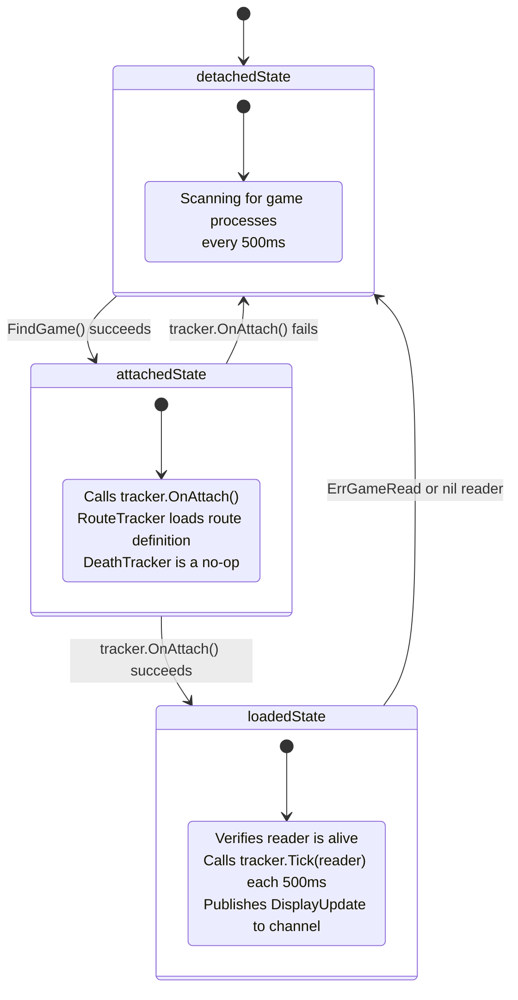
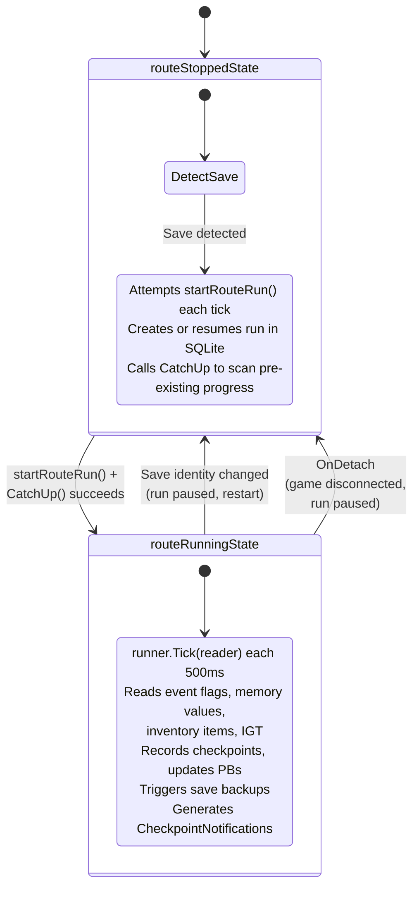

# Architecture

## Core Components

1. **main.go**: Application entry point
   - Parses CLI flags: `-game` (game ID), `-dc` (death counter only), `-route` (route ID)
   - Initializes data repository and process operations
   - Creates `GameTracker` (`DeathTracker` or `RouteTracker`) based on `-dc` flag
   - Creates `GameMonitor` with the tracker; passes monitor to tray
   - Tray consumes `DisplayUpdates()` channel
   - GameMonitor owns the tick loop (500ms poll)

2. **internal/memreader**: Multi-game Windows memory reading
   - Supports 6 FromSoftware games with game-specific offsets
   - Process discovery by executable name (scans all supported games)
   - Automatic architecture detection (32-bit vs 64-bit)
   - Module base address enumeration
   - Pointer chain traversal for memory reading
   - `ReadDeathCount()`: follows pointer chain to death count value
   - `ReadEventFlag(flagID)`: reads event flags using DS3 hierarchical algorithm (ported from SoulSplitter)
   - `ReadIGT()`: reads in-game time in milliseconds
   - `ReadMemoryValue(path, offset, size)`: reads arbitrary values from named memory paths
   - `ReadCharacterName()`: reads UTF-16LE character name via named memory path
   - `ReadSaveSlotIndex()`: reads save slot byte via GameMan AOB-resolved path
   - `resolvePathAddress()`: AOB-aware path resolution (extracted from `ReadMemoryValue`)
   - `ReadInventoryItemQuantity(itemID)`: scans inventory array for matching TypeId, returns quantity
   - `InventoryConfig` struct describes inventory memory layout (path key, offsets, strides)
   - Inventory split into two regions: normal items (0..count-1) and key items (keyStart..capacity-1)
   - **AOB scanning** (`aob.go`): dynamically finds SprjEventFlagMan, FieldArea, GameMan, and GameDataMan pointers at runtime
     - Parses PE header to locate `.text` section, scans in 64KB chunks with overlap
     - Resolves RIP-relative addresses from matched patterns
     - Results cached per attach with fallback to static offsets if AOB fails
   - `GameConfig` includes `EventFlagOffsets64`, `FieldAreaOffsets64`, `IGTOffsets64`, `MemoryPaths`, `SaveFilePattern`, `SprjEventFlagManAOB`, `FieldAreaAOB`, `GameManAOB`, `GameDataManAOB`, `PathBases`, `CharNamePathKey`, `CharNameOffset`, `CharNameMaxLen`, `SaveSlotPathKey`, `SaveSlotOffset`, `Inventory`
   - Auto-reconnection when process starts/stops
   - Memory addresses from DSDeaths project (https://github.com/quidrex/DSDeaths)

3. **internal/route**: Speedrun route tracking
   - **route.go**: Route/Checkpoint data model with JSON loading and validation
   - **state.go**: RunState machine with `ProcessTick` returning `TickResult` (pure logic, no I/O)
   - **runner.go**: Runner orchestrator connecting state machine to memreader, stats, and backup
   - Checkpoints support three condition types: event flag checks (`event_flag_check`), memory value checks (`mem_check`), and inventory quantity checks (`inventory_check`)
   - `BackupFlagCheck` on checkpoints triggers save backup on boss encounter (before the fight)
   - `MemCheck` supports `gte`, `gt`, `eq` comparisons with configurable read size (1/2/4 bytes)
   - `InventoryCheck` supports optional `StateVar` for cumulative tracking with dot notation: `"name"` or `"name.acquired"` (default) tracks pickups, `"name.consumed"` tracks spending
   - `stateVarData` in Runner tracks per-variable `LastQuantity`, `Acquired`, `Consumed`, and `Dirty` flag for DB persistence
   - `TickInput` struct carries flags, memory values, inventory values, IGT, and death count per cycle
   - `TickResult` contains separate `Checkpoints` and `Backups` event lists
   - `CatchUp()` detects and logs pre-existing checkpoint completions on route start
   - Tracks checkpoint times, per-segment deaths, completion percentage
   - Automatically detects run completion when all required checkpoints are done

4. **internal/data**: Data persistence layer
   - **repository.go**: `Repository` struct wrapping SQLite database
     - SQLite-based session management with auto-create/end sessions
     - `saves` table: `(game, slot_index, character_name)` unique key with timestamps
     - `save_id` FK on `sessions` and `route_runs` tables (nullable, migration)
     - `FindOrCreateSave()`: upserts save record, returns `model.Save`
     - `GetOrCreateSessionForSave()`: finds or creates open session for a specific save
     - `RecordDeathForSave()`: records death event scoped to a save identity
     - Route run persistence: `route_runs`, `route_checkpoints`, `route_pbs`, `route_state_vars` tables
     - `StartRouteRun`, `RecordCheckpoint`, `EndRouteRun` for run lifecycle (StartRouteRun accepts optional `saveID`)
     - `FindLatestRun(routeID, saveID)`: finds most recent run by save identity, returns `model.RouteRun`
     - `UpdatePersonalBest` with UPSERT that keeps better times
     - `SaveStateVar`, `LoadStateVars` for cumulative inventory tracking state persistence
     - Supports tracking across multiple games
   - **internal/data/dbm**: Generic database mapper package
     - Lightweight wrapper over `database/sql` with Go generics
     - `Query[T](ctx, db, query, args...)`: scans all rows into `[]T` (structs via `db` tags or primitives)
     - `QueryOne[T](ctx, db, query, args...)`: scans first row; returns `ErrNotFound` if no rows
     - `Exec[T](ctx, db, query, args...)`: struct-bound named params (`:fieldName`) or positional args
     - Nested struct scanning with dot-notation column aliases (e.g. `"save.id"`)
     - Null holder factory for nullable pointer fields (`*time.Time`, `*int64`, `*float64`, `*string`)
   - **internal/data/model**: Database domain models
     - `Save`: character save slot identity (game, slot_index, character_name)
     - `Session`: gaming session with death count and optional save FK
     - `DeathEvent`: individual death record linked to session
     - `RouteRun`: single speedrun execution with status (not_started, in_progress, paused, completed, abandoned)
     - `RouteCheckpoint`: completed checkpoint within a run (IGT, duration, deaths)
     - `RoutePB`: personal best split times per checkpoint
     - `RouteStateVar`: cumulative inventory tracking state
     - Pointer fields (e.g. `*Save`) indicate belongs-to relationships populated via JOINs

5. **internal/backup**: Save file backup
   - Copies save files with timestamped labels at each checkpoint
   - `ResolveSavePath` expands environment variables and glob patterns
   - Auto-creates backup directory

6. **internal/monitor**: Game monitoring lifecycle (State pattern)
   - **GameMonitor** (monitor.go) — owns the 500ms tick loop, display update stream, and `MonitorState`
     - Delegates each tick to `m.state.Tick(m)` — no inline phase checks
     - `Monitor` interface: `Start()`, `Stop()`
     - `setState(s MonitorState)` — transitions the monitor to a new state
     - `detachReader()` — closes reader without touching state or tracker
     - `publish(update DisplayUpdate)` — non-blocking display channel send
   - **MonitorState** interface (state.go) — GoF State pattern, states mutate GameMonitor internally
     - `Attach(m *GameMonitor) (*GameReader, error)` — state-specific attach logic
     - `Detach(m *GameMonitor)` — tears down connection, transitions to detached
     - `Tick(m *GameMonitor) error` — calls Attach, handles errors, delegates to tracker
     - `Phase() MonitorPhase` — returns phase for display/status
   - **detachedState** (state_detached.go) — scans for game process via FindGame
   - **attachedState** (state_attached.go) — calls tracker.OnAttach to load game resources
   - **loadedState** (state_loaded.go) — verifies reader, delegates to tracker.Tick, publishes updates
   - **GameTracker** interface — receives GameReader each tick, processes data, returns DisplayUpdate
     - `OnAttach(gameID string) error` — called when game process is first attached
     - `OnDetach()` — called when game process disconnects
     - `Tick(reader *GameReader) (DisplayUpdate, error)` — called each 500ms while loaded
   - **baseTracker** (tracker.go) — shared struct embedded by both tracker implementations
     - `detectSave()` — reads character name + save slot, creates DB record, rejects slot 255
     - `recordDeathIfChanged()` — records death count changes to DB
     - `resetOnDetach()` — clears all tracking state on game disconnect
     - Log spam prevention: `saveLoggedOnce` and `loadLoggedOnce` flags
   - **DeathTracker** (deathtracker.go) — stateless death counting, embeds `baseTracker`
     - No internal state machine; reads death count each tick, records changes to DB
     - Best-effort save detection and IGT reading
     - Returns `ErrGameRead` on unrecoverable read failure → triggers Monitor detach
   - **RouteTracker** (routetracker.go) — death counting + route tracking, embeds `baseTracker`
     - Uses **State pattern** via `trackerState` interface with two concrete states
     - Save change detection: if identity changes mid-run → pause run, transition to stopped, restart
   - **trackerState** interface (tracker_state.go) — GoF State pattern for route lifecycle
     - `OnAttach(t *RouteTracker, gameID string) error`
     - `OnDetach(t *RouteTracker)`
     - `Tick(t *RouteTracker, reader *GameReader) (DisplayUpdate, error)`
     - `IsRunning() bool`
   - **routeStoppedState** (tracker_state_stopped.go) — loads route on attach, detects save, attempts startRouteRun each tick
   - **routeRunningState** (tracker_state_running.go) — active tracking via runner.Tick, checkpoint recording, backup triggers
   - `DisplayUpdate` struct: carries game name, status, death count, IGT, character name, save slot index, and route display
   - `RouteDisplay` struct: route name, completion %, checkpoint counts, current checkpoint, segment deaths, `CompletedEvents`
   - `CheckpointNotification` struct: name, IGT, duration, deaths — drives achievement popup
   - Key files: `monitor.go`, `state.go`, `state_detached.go`, `state_attached.go`, `state_loaded.go`, `tracker.go`, `tracker_state.go`, `tracker_state_stopped.go`, `tracker_state_running.go`, `deathtracker.go`, `routetracker.go`

### Monitor State Machine

The app uses the **GoF State pattern**: **GameMonitor** owns the 500ms tick loop and delegates each tick to a `MonitorState` interface. Three concrete states (`detachedState`, `attachedState`, `loadedState`) implement `Attach`, `Detach`, and `Tick` — states mutate the monitor internally via `setState()`. A **GameTracker** (either `DeathTracker` or `RouteTracker`) processes game data each tick once the loaded state is reached.



#### MonitorState Implementations

| State | Phase | Status Text | Description |
|-------|-------|-------------|-------------|
| `detachedState` | **Detached** | "Waiting for game..." | Scans for game process via `FindGame()` |
| `attachedState` | **Attached** | "Attached" | Calls `tracker.OnAttach()` to load game resources |
| `loadedState` | **Loaded** | "Loaded" | Verifies reader, delegates to `tracker.Tick()`, publishes updates |

### RouteTracker State Machine

The **RouteTracker** uses a second, independent State pattern nested within the monitor's loaded state. The `trackerState` interface defines two concrete states that manage the route run lifecycle.



#### trackerState Implementations

| State | IsRunning | Status Text | Description |
|-------|-----------|-------------|-------------|
| `routeStoppedState` | `false` | "Loaded" | Loads route on attach, detects save, attempts `startRouteRun` each tick |
| `routeRunningState` | `true` | "Tracking route" | Active checkpoint tracking via `runner.Tick()`, death recording |

### DeathTracker

The **DeathTracker** is the simpler of the two `GameTracker` implementations. It has **no internal state machine** — it performs a straightforward read-and-record cycle each tick:

1. **Best-effort save detection**: Reads character name + save slot (non-blocking, ignores errors)
2. **Read death count**: Follows pointer chain to the death count value
   - On `ErrNullPointer` (game still loading): returns a "Loaded" update with no count
   - On unrecoverable error: returns `ErrGameRead` which triggers Monitor detach
3. **Record changes**: If the death count changed since last tick, records the new count to SQLite
4. **Best-effort IGT read**: Reads in-game time if available
5. **Return DisplayUpdate**: Carries game name, death count, character name, save slot, IGT

The DeathTracker tracks deaths ephemerally — it only maintains the last-seen death count for change detection. All persistence is delegated to the `Repository`.

### Memory Address Details

Each game stores the death count at different memory locations:

- **Dark Souls PTDE**: `base + 0xF78700 → [+0x5C]`
- **Dark Souls II (32-bit)**: `base + 0x1150414 → [+0x74] → [+0xB8] → [+0x34] → [+0x4] → [+0x28C] → [+0x100]`
- **Dark Souls II (64-bit)**: `base + 0x16148F0 → [+0xD0] → [+0x490] → [+0x104]`
- **Dark Souls III**: `base + 0x47572B8 → [+0x98]`
- **Dark Souls Remastered**: `base + 0x1C8A530 → [+0x98]`
- **Sekiro**: `base + 0x3D5AAC0 → [+0x90]`
- **Elden Ring**: `base + 0x3D5DF38 → [+0x94]`

These addresses are for current game versions as of the DSDeaths project. If a game updates, addresses may need to be updated in `internal/memreader/config.go`.

7. **internal/tray**: System tray UI (Bridge pattern)
   - **platform.go**: Bridge abstraction — `TrayPlatform` interface composed of 4 ISP sub-interfaces:
     - `TrayIcon` — icon management (`SetIcon`, `SetTooltip`, `SetVisible`, `SetLeftClickShowsMenu`)
     - `MenuBuilder` — context menu (`AddMenuItem`, `AddClickableMenuItem`, `SetMenuItemText`, `AddSubmenu`)
     - `Notifier` — popup notifications (`ShowNotification`)
     - `Lifecycle` — window lifecycle (`Init`, `RunMessagePump`, `Synchronize`, `Shutdown`)
   - `MenuItemID` string constants identify menu items across the bridge boundary
   - **app.go**: Platform-agnostic tray application (no build tag, no walk imports)
     - `App` struct holds `TrayPlatform`, `monitor.Monitor`, `*data.Repository`
     - `NewApp(platform, mon, repo)` — constructor with dependency injection
     - `Run()` — full lifecycle: Init → icon → menu → Start monitor → consume updates → RunMessagePump → onExit
     - `buildMenu()` — creates menu via `platform.AddMenuItem`/`AddSubmenu`
     - `refreshDisplay(DisplayUpdate)` — updates menu items via `platform.SetMenuItemText`
     - `refreshRouteDisplay(*RouteDisplay)` — updates route-specific items
   - **walk_platform.go**: `WalkPlatform` implementing `TrayPlatform` via lxn/walk (`//go:build windows`)
     - Holds `*walk.MainWindow`, `*walk.NotifyIcon`, `map[MenuItemID]*walk.Action`
     - Converts `image.Image` to `*walk.Icon` in `SetIcon`
     - `Synchronize` delegates to `mainWindow.Synchronize(fn)`
   - **walk_notification.go**: Checkpoint achievement popup (`//go:build windows`)
     - Borderless topmost window showing checkpoint name, segment time, deaths
     - Auto-dismisses after 4 seconds; positioned top-center of primary monitor
   - **display.go**: Pure text formatting functions (no walk dependency)
     - `formatStatusText`, `formatGameText`, `formatCharacterText`, `formatDeathCountText`, `resolveRouteTexts`, `formatCheckpointNotification`
   - **icon.go**: Returns `image.Image` from embedded PNG (no walk dependency, no build tag)
   - **icon_data.go**: Generated ICO/PNG byte data
   - Requires Windows manifest resource (embedded via `rsrc` at build time) for WalkPlatform
   - Key files: `platform.go`, `app.go`, `walk_platform.go`, `walk_notification.go`, `display.go`

## Memory Reading Flow

```
Scan All Games → Find Running Process → Get Base Address → Detect 32/64-bit →
Select Offsets → Follow Pointer Chain → Read Death Count (uint32)
```

Each game has a unique pointer chain that must be followed from the module base address to reach the death count value. The chain consists of:
1. Start at module base address
2. Add first offset and read pointer
3. Follow pointer, add next offset, read next pointer
4. Repeat until final offset
5. Final value is the death count (not a pointer)

## Data Flow

```
GameMonitor Start (500ms ticker) → state.Tick(m):
  detachedState.Tick  → Attach: FindGame → found? setState(attached), return
  attachedState.Tick  → Attach: tracker.OnAttach → ok? setState(loaded), return
  loadedState.Tick    → Attach: verify reader → tracker.Tick(reader) → publish(update)
                      → on ErrGameRead: Detach → setState(detached), publish detached

DisplayUpdate → channel → App goroutine → platform.Synchronize → refreshDisplay:
  → platform.SetMenuItemText for each menu field
  → platform.SetTooltip for tooltip
  → CompletedEvents → platform.ShowNotification per checkpoint

GameTracker.Tick (DeathTracker):
  detectSave() → ReadDeathCount() → recordDeathIfChanged() → return DisplayUpdate

GameTracker.Tick (RouteTracker):
  routeStoppedState.Tick:
    detectSave() → save change? → handleSaveChanged
    → startRouteRun() → CatchUp → transition to routeRunningState
  routeRunningState.Tick:
    detectSave() → save change? → handleSaveChanged → transition to routeStoppedState
    → runner.Tick(reader) → Read Event Flags + Memory Values + Inventory Items
      → ProcessTick (state machine) → Record Checkpoints → Update PBs
      → Trigger Save Backup → Generate CheckpointNotifications
    → recordDeathIfChanged() → return DisplayUpdate (with route + CompletedEvents)
```

## Route Runner Startup Flow

When the app detects a matching game, the route runner starts with this sequence:

1. **Game Detection**: `detachedState.Attach()` finds game process → `setState(attachedState)`
2. **OnAttach**: `attachedState.Attach()` calls `RouteTracker.OnAttach()` → loads route → `setState(loadedState)`
3. **Save Detection**: `RouteTracker.Tick()` calls `detectSave()` — reads character name + save slot, rejects slot 255, creates save record in DB (retries on `ErrNullPointer` while game loads, logs once to avoid spam)
4. **Route Start** (`startRouteRun`): Calls `FindLatestRun(routeID, saveID)` to find the most recent run by save identity. If found with status `not_started` or `in_progress`, resumes it; otherwise creates a new run in SQLite. Transitions to `routeRunningState` after successful CatchUp
5. **CatchUp Loop** (`runner.go:CatchUp`): Retries each tick until event flags are readable
   - First `ReadEventFlag()` call triggers **lazy AOB initialization** (`initEventFlagPointers`):
     - Scans `.text` section for SprjEventFlagMan, FieldArea, and GameMan AOB patterns
     - Resolves RIP-relative addresses and caches them (one-time cost per attach)
   - Scans all checkpoint flags and inventory conditions — marks already-set ones as completed with `[Route] Already completed: X`
   - Marks backup as done for already-completed bosses (prevents unnecessary backups)
   - Returns `false` on `ErrNullPointer` (game still loading) → retries next tick
6. **Death Count Read**: Logs initial death count after CatchUp completes
7. **Normal Tick Loop** (`runner.go:Tick`): Every 500ms:
   - Reads **backup flags** (boss encounter) for uncompleted checkpoints
   - Reads **event flags** (boss kill) for uncompleted checkpoints
   - Reads **memory values** (level, weapon upgrade) for `mem_check` checkpoints
   - Reads **inventory item quantities** for `inventory_check` checkpoints
   - Reads **IGT** (in-game time)
   - `ProcessTick` returns `TickResult` with checkpoint and backup events:
     - `BackupEvent`: encounter flag newly set → triggers save file backup (before the fight)
     - `CheckpointEvent`: kill condition met → records split in DB, updates PB
     - If no `backup_flag_check` configured, backup triggers on kill instead
   - When all required checkpoints are done → marks run as `RunCompleted`
8. **Save Change Detection**: If `detectSave()` detects different character/slot mid-run → abandon run, end session, restart route with new save identity

## Design Patterns

### State Pattern — GameMonitor (monitor package)
- **Problem**: Game monitoring has distinct phases (scanning, attaching, tracking) with different behaviors per phase
- **Implementation**: `MonitorState` interface with 3 concrete states (`detachedState`, `attachedState`, `loadedState`)
- **Files**: `state.go`, `state_detached.go`, `state_attached.go`, `state_loaded.go`
- States mutate the monitor internally via `setState()` — classic GoF State pattern

### State Pattern — RouteTracker (monitor package)
- **Problem**: Route tracking toggles between "trying to start" and "actively tracking" with different tick behavior
- **Implementation**: `trackerState` interface with 2 concrete states (`routeStoppedState`, `routeRunningState`)
- **Files**: `tracker_state.go`, `tracker_state_stopped.go`, `tracker_state_running.go`
- Nested within Monitor's loaded state — a second independent state machine

### Bridge Pattern — Tray UI (tray package)
- **Problem**: Tray app logic was directly coupled to `lxn/walk` Windows GUI toolkit, making it impossible to test on macOS/Linux or without a Windows desktop session
- **Implementation**: `TrayPlatform` interface (composed of 4 ISP sub-interfaces: `TrayIcon`, `MenuBuilder`, `Notifier`, `Lifecycle`) separates the abstraction (`App`) from the implementation (`WalkPlatform`)
- **Files**: `platform.go` (interfaces), `app.go` (abstraction), `walk_platform.go` (implementation)
- **Benefit**: `app.go` has zero `lxn/walk` imports; tests use `mockPlatform`; fully cross-platform testable

### Strategy Pattern — GameTracker (monitor package)
- **Problem**: Two tracking modes (death-only vs route tracking) with shared base behavior (save detection, death recording)
- **Implementation**: `GameTracker` interface with `DeathTracker` (stateless) and `RouteTracker` (stateful) strategies
- **Files**: `deathtracker.go`, `routetracker.go`, `tracker.go` (shared `baseTracker`)
- Selected at startup via `-dc` flag in `main.go`

## Architecture Notes

### Why Pointer Chains?

Games don't store death counts at static addresses. Instead:
- Death count is part of a dynamic data structure (player stats)
- Structure is allocated at runtime (address changes each run)
- Game maintains a static pointer to this structure
- We follow the pointer chain from static → dynamic → death count

### 32-bit vs 64-bit

- 32-bit processes use 4-byte pointers
- 64-bit processes use 8-byte pointers
- Must detect architecture to parse pointers correctly
- Some games have both versions (DS2), others only 64-bit (DS3, Sekiro, Elden Ring)

### Module Base Address

- Each executable loads at a base address in memory
- Base address can change (ASLR) but is consistent during runtime
- Offsets are relative to base address
- Must enumerate modules to find correct base address

## Testing

- **Route and state machine tests** (`internal/route/`): Pure Go logic, fully testable on any platform
- **Data tests** (`internal/data/`): SQLite-based repository and dbm mapper tests, platform-independent
- **Backup tests** (`internal/backup/`): File operations, platform-independent
- **Memory reader tests** (`internal/memreader/`): Use `mockProcessOps` to simulate Windows API without a running game
  - `ds3_offsets_test.go`: Flag constant validation (counts, uniqueness, bit patterns, pinned CT values)
- **Route integration tests** (`internal/route/`): `route_integration_test.go` validates route file flag IDs against exported `memreader` constants
- **Monitor tests** (`internal/monitor/`): Uses mock ProcessOps, tests save detection gate, save change handling, display updates
- **Tray tests** (`internal/tray/`):
  - `display_test.go`: Pure text formatting tests (cross-platform)
  - `app_test.go`: App lifecycle, menu building, display refresh, notification dispatch, channel consumption, stats callbacks — uses `mockPlatform` (cross-platform, no walk dependency)
  - `tray_ui_test.go`: WalkPlatform integration tests (requires Windows desktop + manifest, `e2e && ui` tags)
- **E2e tests** (`internal/memreader/`): Cover all 25 DS3 boss defeated flags, 17 encountered flags, and 22 inventory item constants (goods, rings, weapons)
- Manual testing with actual games recommended for end-to-end validation
