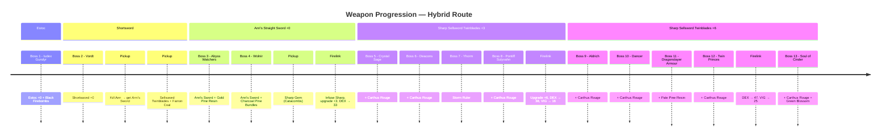

# Dark Souls III - Glitchless Any% — Hybrid +10 Route

Route-specific document for the Hybrid +10 route variant.
Based on the [Hybrid route](ds3-glitchless-any-percent-hybrid.md) with modifications.

For shared category rules, boss sequence, and tooling notes see
[ds3-glitchless-any-percent.md](ds3-glitchless-any-percent.md).

## Route Summary

| Attribute | Value |
|-----------|-------|
| **Route Name** | Hybrid (labeled "Anri's Straight Sword" on speedrun.com) |
| **Weapons** | Estoc → Shortsword → Anri's Straight Sword → Sharp Sellsword Twinblades |
| **Scaling Stat** | Dexterity |
| **Burial Gift** | Black Firebomb |
| **Best Time** | 41:25 IGT (olzku23) |
| **Leaderboard Status** | Dominant — all top 10 use this route |
| **WR Run** | [olzku23 41:25 IGT](https://www.speedrun.com/darksouls3/runs/y9kdlxez) ([VOD](https://youtu.be/TSmo3-h-6KI)) |
| **Route Notes** | [SoulsSpeedruns Wiki](https://soulsspeedruns.com/darksouls3/anris-straight-sword-any) (by KinetikCx) |

---

## Build

### Leveling Strategy

- Primary stat: **Dexterity**
- After Wolnir (Firelink visit 2): DEX to 33
- After Anor Londo (Firelink visit 4): DEX to 38, VIG to 16
- Before Soul of Cinder: DEX to 47, VIG to 25

### Why DEX?

The primary damage weapon is the **Sharp Sellsword Twinblades** which has A-scaling with DEX.
Anri's Straight Sword is used unupgraded (+0) only for its passive HP regen and early-game
utility — the route does **not** invest in Luck.

---

## Weapon Progression

This route uses 3 weapons in sequence. Each serves a specific purpose at different stages.

### Weapon 1: Estoc (Boss 1)

| Attribute | Value |
|-----------|-------|
| **Source** | Assassin starting weapon |
| **Infusion** | None |
| **Upgrade** | +0 |
| **Used for** | Iudex Gundyr |

The Assassin's starting Estoc is used for the tutorial boss. Black Firebombs supplement damage.

### Weapon 2: Shortsword (Boss 2)

| Attribute | Value |
|-----------|-------|
| **Source** | Purchased at Firelink Shrine |
| **Infusion** | None |
| **Upgrade** | +0 |
| **Used for** | Vordt |

The Shortsword is purchased at Firelink after Iudex Gundyr and used to kill Vordt.

### Weapon 3: Anri's Straight Sword (Bosses 3-4)

| Attribute | Value |
|-----------|-------|
| **Source** | Kill Anri of Astora at Halfway Fortress (Road of Sacrifices) |
| **Infusion** | None (innate Luck scaling, but route doesn't invest in Luck) |
| **Upgrade** | +0 (unupgraded) |
| **Used for** | Abyss Watchers, Wolnir, Farron Keep traversal |

Anri's Straight Sword is used **not for damage** but for its **passive HP regeneration**
(Blessed effect: 2 HP/2s). This is critical for surviving Farron Keep's poison swamp without
wasting Estus. It provides adequate damage for Abyss Watchers and Wolnir with resin buffs.

### Weapon 4: Sharp Sellsword Twinblades (Bosses 5-13)

| Attribute | Value |
|-----------|-------|
| **Source** | World pickup in Road of Sacrifices (near Farron Coal) |
| **Infusion** | Sharp (requires Farron Coal given to Andre) |
| **Upgrade** | +3 after Wolnir → +6 after Anor Londo |
| **Used for** | Crystal Sage through Soul of Cinder (9 of 13 bosses) |

The Sharp Sellsword Twinblades are the **primary damage weapon** for the majority of the run.
L1 dual-wield combos with Carthus Rouge deal massive damage. The transition happens at
Firelink after Wolnir, when the runner has enough souls and materials to upgrade and infuse.

### Weapon Switch Timeline

---

## Boss Kill Order

13 mandatory bosses fought in this sequence (based on olzku23's WR):

| # | Boss | Weapon | Buff |
|---|------|--------|------|
| 1 | Iudex Gundyr | Estoc + Black Firebombs | None |
| 2 | Vordt of the Boreal Valley | Shortsword | None |
| 3 | Abyss Watchers | Anri's Straight Sword | Gold Pine Resin |
| 4 | High Lord Wolnir | Anri's Straight Sword | Charcoal Pine Bundles |
| 5 | Crystal Sage | Sharp Sellsword Twinblades +3 | Carthus Rouge |
| 6 | Deacons of the Deep | Sharp Sellsword Twinblades +3 | Carthus Rouge |
| 7 | Yhorm the Giant | Storm Ruler | N/A |
| 8 | Pontiff Sulyvahn | Sharp Sellsword Twinblades +3 | Carthus Rouge |
| 9 | Aldrich, Devourer of Gods | Sharp Sellsword Twinblades +6 | Carthus Rouge |
| 10 | Dancer of the Boreal Valley | Sharp Sellsword Twinblades +6 | Carthus Rouge |
| 11 | Dragonslayer Armour | Sharp Sellsword Twinblades +6 | Pale Pine Resin |
| 12 | Twin Princes | Sharp Sellsword Twinblades +6 | Carthus Rouge |
| 13 | Soul of Cinder | Sharp Sellsword Twinblades +6 | Carthus Rouge + Green Blossom |

**Key routing notes:**
- Dancer is fought **late** (10th boss), triggered by killing Emma after Aldrich
- Abyss Watchers + Wolnir are fought **before** Crystal Sage (backtrack to Sage after)
- Yhorm is fought **before** Pontiff (non-linear Irithyll progression)
- Oceiros and Champion Gundyr are **not fought**

---

## Route Overview

### Phase 1: Cemetery of Ash + Firelink Shrine

1. Pick up Ashen Estus Flask
2. Unequip head/chest armor for faster rolls
3. **Boss: Iudex Gundyr** (Estoc + Black Firebombs)
4. Firelink Shrine: purchase Dagger, Shortsword, Homeward Bones

### Phase 2: High Wall of Lothric + Vordt

5. Pick up Gold Pine Resin
6. Descend via Spook to fountain area
7. **Boss: Vordt of the Boreal Valley** (Shortsword)
8. Take Small Lothric Banner to Undead Settlement

### Phase 3: Undead Settlement + Road of Sacrifices

9. Navigate to Road of Sacrifices
10. Kill Anri of Astora at Halfway Fortress to obtain **Anri's Straight Sword**
11. Pick up **Farron Coal** (behind Black Knight)
12. Pick up **Sellsword Twinblades** (nearby corpse)
13. Pick up Grasscrest Shield

### Phase 4: Farron Keep + Catacombs

14. Navigate Farron Keep (Anri's Sword HP regen sustains through poison)
15. **Boss: Abyss Watchers** (Anri's Straight Sword + Gold Pine Resin)
16. Navigate Catacombs of Carthus
17. Pick up **Sharp Gem** (behind illusory wall in tunnel)
18. **Boss: High Lord Wolnir** (Anri's Straight Sword + Charcoal Pine Bundles)

### Phase 5: Firelink Shopping — Weapon Transition

19. Sell boss souls (Wolnir, Vordt) for souls
20. Give **Farron Coal** to Blacksmith Andre
21. Buy 12 Titanite Shards
22. **Upgrade Sellsword Twinblades to +3** at Andre
23. **Infuse with Sharp Gem** at Andre
24. Buy Carthus Rouge (x9), Homeward Bones
25. **Level DEX to 33**

### Phase 6: Backtrack — Crystal Sage + Deacons

26. Warp to Crucifixion Woods
27. **Boss: Crystal Sage** (Sharp Sellsword Twinblades +3 + Carthus Rouge)
28. Proceed to Cathedral of the Deep
29. **Boss: Deacons of the Deep** (obtain Small Doll)
30. Homeward Bone to Firelink

### Phase 7: Irithyll + Profaned Capital + Anor Londo

31. Enter Irithyll of the Boreal Valley (Small Doll required)
32. Navigate to Profaned Capital
33. **Boss: Yhorm the Giant** (Storm Ruler)
34. Navigate to Irithyll / Church of Yorshka
35. **Boss: Pontiff Sulyvahn** (Sharp Twinblades +3 + Carthus Rouge)
36. Navigate to Anor Londo
37. **Boss: Aldrich, Devourer of Gods** (Sharp Twinblades +6 + Carthus Rouge)

### Phase 7.5: Firelink — Second Upgrade

- Between Pontiff/Aldrich area: upgrade Twinblades to **+6**, level DEX to 38, VIG to 16

### Phase 8: Dancer + Lothric Castle + Grand Archives

38. After Aldrich, teleported to Emma's room — kill Emma to trigger Dancer
39. **Boss: Dancer of the Boreal Valley** (Sharp Twinblades +6 + Carthus Rouge)
40. Proceed up ladder into Lothric Castle
41. **Boss: Dragonslayer Armour** (Sharp Twinblades +6 + Pale Pine Resin)
42. Grand Archives
43. **Boss: Twin Princes** (Sharp Twinblades +6 + Carthus Rouge)
44. Place all Lords of Cinder on their thrones

### Phase 9: Kiln of the First Flame

45. Level DEX to 47, VIG to 25
46. Warp to Kiln of the First Flame
47. **Boss: Soul of Cinder** (Sharp Twinblades +6 + Carthus Rouge + Green Blossom)
48. Link the First Flame
49. Timer ends when IGT is confirmed on Load Game screen

---

## Approximate Split Times

Times are cumulative IGT. "Good run" targets ~45:00 finish. "Competitive" is near-WR (~41:30).

| # | Split | Weapon | Good Run (IGT) | Competitive (IGT) |
|---|-------|--------|---------------|--------------------|
| 1 | Iudex Gundyr | Estoc | ~1:50 | ~1:35 |
| 2 | Vordt | Shortsword | ~4:30 | ~3:45 |
| 3 | Abyss Watchers | Anri's Sword | ~12:00 | ~10:30 |
| 4 | Wolnir | Anri's Sword | ~13:30 | ~12:00 |
| 5 | Crystal Sage | Sharp Twinblades +3 | ~17:00 | ~15:00 |
| 6 | Deacons | Sharp Twinblades +3 | ~19:30 | ~17:30 |
| 7 | Yhorm | Storm Ruler | ~25:00 | ~22:30 |
| 8 | Pontiff Sulyvahn | Sharp Twinblades +3 | ~28:00 | ~25:30 |
| 9 | Aldrich | Sharp Twinblades +6 | ~31:00 | ~28:00 |
| 10 | Dancer | Sharp Twinblades +6 | ~33:00 | ~30:00 |
| 11 | Dragonslayer Armour | Sharp Twinblades +6 | ~37:00 | ~34:00 |
| 12 | Twin Princes | Sharp Twinblades +6 | ~41:00 | ~37:30 |
| 13 | Soul of Cinder | Sharp Twinblades +6 | ~45:00 | ~41:30 |

---

## Key Bonfires

| # | Bonfire | How Obtained |
|---|---------|--------------|
| 1 | Firelink Shrine | Automatic |
| 2 | High Wall of Lothric | Automatic from warp |
| 3 | Vordt of the Boreal Valley | Post-boss |
| 4 | Undead Settlement | Banner ride |
| 5 | Halfway Fortress | Road of Sacrifices |
| 6 | Farron Keep Perimeter | Catacombs side |
| 7 | Catacombs of Carthus | Lit manually |
| 8 | Irithyll of the Boreal Valley | Central Irithyll |
| 9 | Profaned Capital | Lit manually |
| 10 | Anor Londo | Lit manually |
| 11 | Dancer of the Boreal Valley | Post-boss |
| 12 | Grand Archives | Lit manually |
| 13 | Kiln of the First Flame | Automatic |

---

## Key Items

| Item | Location | Purpose |
|------|----------|---------|
| Ashen Estus Flask | Cemetery of Ash | FP recovery for Spook |
| Dagger | Firelink (purchased) | Fall damage cancel |
| Shortsword | Firelink (purchased) | Weapon for Vordt |
| Gold Pine Resin | High Wall of Lothric | Lightning buff for Abyss Watchers |
| Small Lothric Banner | High Wall of Lothric | Access Undead Settlement |
| Anri's Straight Sword | Kill Anri (Halfway Fortress) | HP regen + early boss weapon |
| Farron Coal | Road of Sacrifices (behind Black Knight) | Unlocks Sharp infusion at Andre |
| Sellsword Twinblades | Road of Sacrifices (corpse near Farron Coal) | Primary damage weapon |
| Grasscrest Shield | Road of Sacrifices | Passive stamina regen |
| Sharp Gem | Catacombs of Carthus (behind illusory wall) | Sharp infusion for Twinblades |
| Titanite Shards (x12) | Blacksmith Andre (purchased) | Upgrade Twinblades to +3 |
| Large Titanite Shards (x12) | Blacksmith Andre (purchased) | Upgrade Twinblades to +6 |
| Carthus Rouge (x9) | Shrine Handmaid (purchased) | Bleed buff for boss fights |
| Charcoal Pine Bundles | Undead Settlement | Fire buff for Wolnir |
| Pale Pine Resin | Irithyll | Magic buff for Dragonslayer Armour |
| Green Blossom | Road of Sacrifices | Stamina regen for Abyss Watchers, Soul of Cinder |
| Storm Ruler | Yhorm boss arena | Required to kill Yhorm |
| Basin of Vows | Kill Emma (after Aldrich) | Triggers Dancer |
| Homeward Bones | Shrine Handmaid (purchased) | Return to bonfire |

---

## Why "Anri's Route" Is Actually a Hybrid

The route is named after Anri's Straight Sword on speedrun.com because that weapon defines the
early-to-mid game strategy. However:

- Anri's Sword is used for only **2 of 13 boss fights** (Abyss Watchers, Wolnir)
- It is **never upgraded** (+0) and the route **does not invest in Luck**
- Its value is the **passive HP regen** for Farron Keep poison and early-game sustainability
- The **Sharp Sellsword Twinblades** are the actual primary weapon for **9 of 13 bosses**
- The build is **DEX-focused** (up to 47 DEX), not Luck

The route should more accurately be called a hybrid or 4-weapon route, but the community
convention on speedrun.com uses "Anri's Straight Sword" as the route label.

---

## Route Advantages

- **Fastest proven route** — dominates top 10 leaderboard (WR 41:25)
- **Best of both worlds** — Anri's HP regen for early survival + Twinblades DPS for late bosses
- **DEX is versatile** — benefits cast speed and other weapons
- **Carthus Rouge on Twinblades** — L1 dual-hits apply bleed twice, devastating on susceptible bosses
- **Efficient weapon transitions** — each weapon serves a clear purpose at the right time

## Route Disadvantages

- **Complex execution** — 4 weapon transitions require precise inventory management
- **Requires NPC kill** — must find and kill Anri for the sword
- **Multiple material pickups** — Farron Coal, Sharp Gem, Titanite Shards, Large Titanite Shards
- **Late infusion** — Twinblades aren't Sharp-infused until after Wolnir (4th boss)
- **More Firelink visits** — multiple shopping trips for upgrades and leveling
